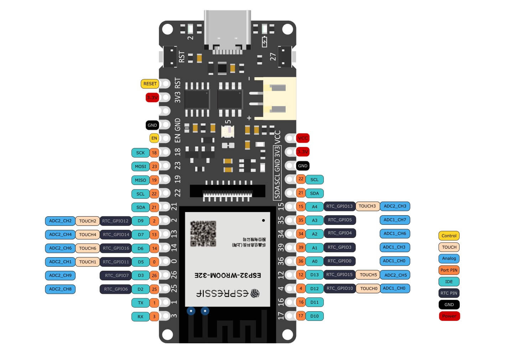
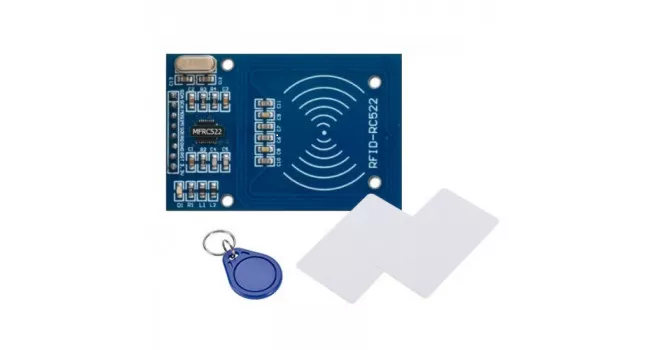
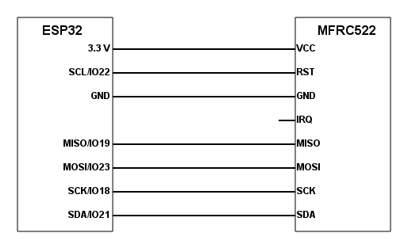

# Example of Creating a RFid to BLE Bridge Application using .NET MAUI

This solution is using a Mfrc522 Rfid reader to illustrate creating an Rfid solution and bridging the output via bluetooth low energy (BLE) to a mobile application.

The solution is using a .NET MAUI mobile application and a .NET Nanoframework Rfid reader solution using an DFRobot Firebeetle 2 ESP32. 

This is currently build and tested only for Android.

### ESP32 
 
### Rfid Reader
 
 ### Wiring
 
